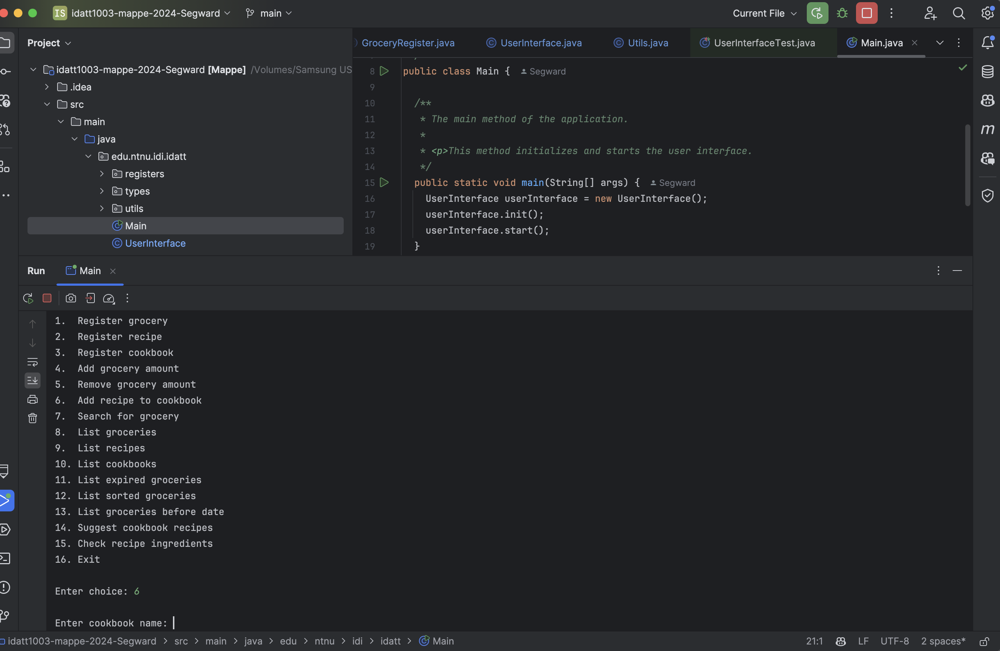
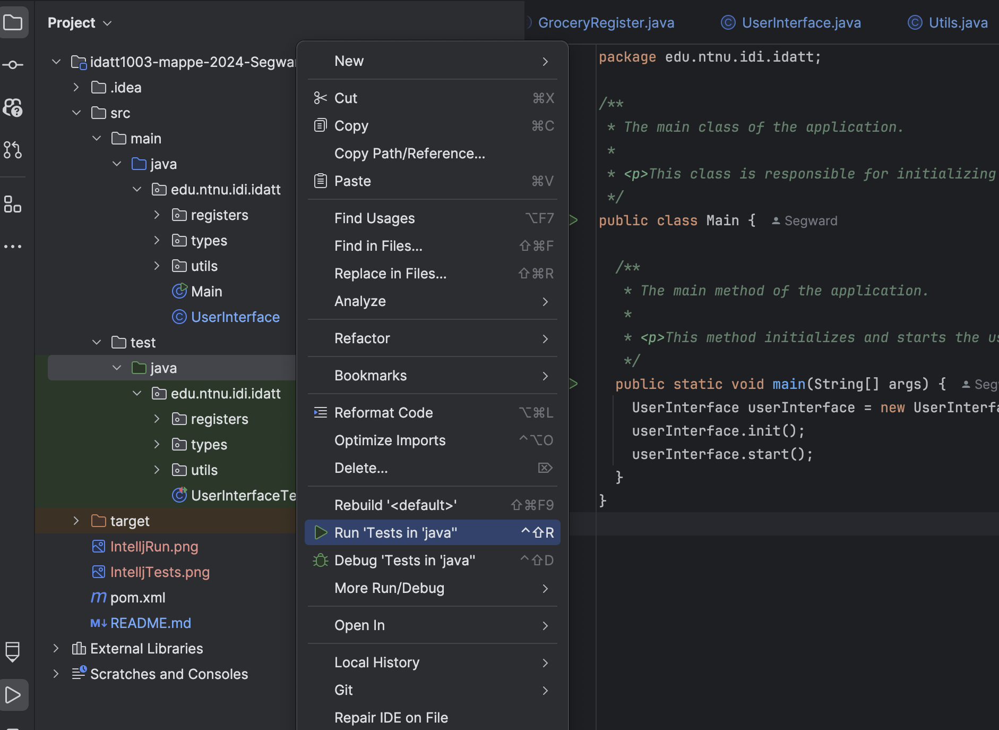

# Semester prosjekt IDATT1004

[//]: # "TODO: Fill inn your name and student ID"

STUDENT NAME = `Gustav Skyberg`  
STUDENT ID = `119656`

## Project description

[//]: # "TODO: Write a short description of your project/product here."

In this project we had to make a grocery storage system where you could register, list groceries, sort groceries and more. We also had to implement recipies and cooking books. The enduser should be able to check what they had in storage and what they could make with the ingredients they had. The project had to be made in Java with a maven project structure. Furthermore we had to implement full JUnit testing and JavaDoc documentation.

## Project structure

[//]: # "TODO: Describe the structure of your project here. How have you used packages in your structure. Where are all sourcefiles stored. Where are all JUnit-test classes stored. etc."

The source code can be found in `src/main/java/edu/ntnu/idi/idatt` and the JUnit-test classes can be found in `src/test/java/edu/ntnu/idi/idatt`

## Link to repository

[//]: # "TODO: Include a link to your GitHub repository here."

The repository can be found [here](https://github.com/NTNU-IDI/idatt1003-mappe-2024-Segward)

## How to run the project

[//]: # "TODO: Describe how to run your project here. What is the main class? What is the main method?
What is the input and output of the program? What is the expected behaviour of the program?"

The project has a main method that can be found at `src/main/java/edu/ntnu/idi/idatt/Main.java`. This method starts the whole application. To build the maven project use `mvn package`. Then run the built jar file with `java -jar target/Mappe-1.0-SNAPSHOT.jar`. You can also run the code in Intellj IDEA by running the main file, which contains the main method. Look at the image below for visual details for running in Intellj IDEA.    

## How to run the tests 

[//]: # "TODO: Describe how to run the tests here."

There are several methods to run the project tests. A method which only uses the terminal is using `mvn test`. You can also use Intellj IDEA to test the project by running the test files or by running the tests in idatt. Look at the image below for visual details for testing with Intellj IDEA.    

## References

[//]: # "TODO: Include references here, if any. For example, if you have used code from the course book, include a reference to the chapter.
Or if you have used code from a website or other source, include a link to the source."

I learned about streams at [geeksforgeeks](https://www.geeksforgeeks.org/stream-in-java/)  
I learned about junit testing at [geeksforgeeks](https://www.geeksforgeeks.org/introduction-to-junit-5/)
